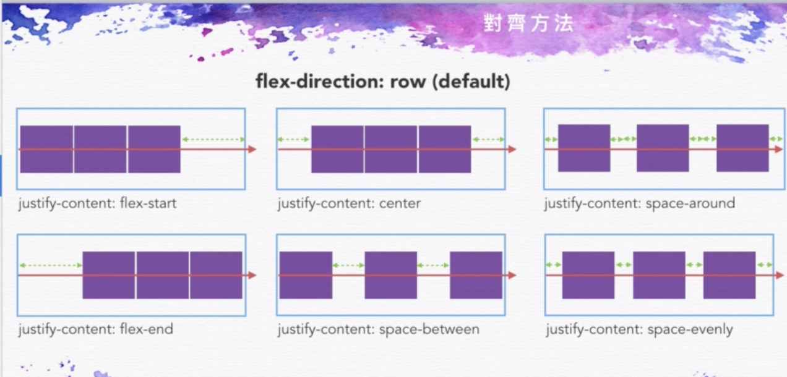
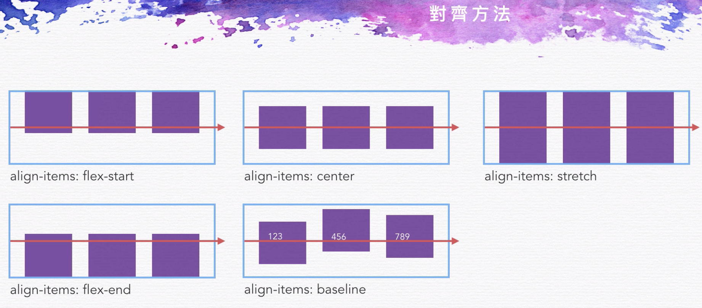

# Html
	
`<!DOCTYPE html>` 定義使用html5

`<meta charset = "UTF-8">` html用中文編碼

`<link rel="stylesheet" href="">` 插入css檔案  
* * *
## css撰寫方式
選擇器{  
&nbsp; 屬性：設定值;  
}  

選擇器:擬態選擇器行為{  
&nbsp; 屬性：設定值;  
} 
 
###後代選擇器  
選擇器1 選擇器2{  
&nbsp; 屬性：設定值;  
}

###css rest 
 [meyerweb](https://meyerweb.com/eric/tools/css/reset/ "")
 
###css 3盒模型
*{   
	&nbsp;  box-sizing:border-box;  
	&nbsp; -moz-box-sizing:border-box;  
	&nbsp; -webkit-box-sizing:border-box;  
}  

預設值box-sizing:content-box;  
-moz-box- 舊firfox前綴詞  
-webkit-box- 舊chorm前綴詞

不會因為border padding影響實際大小

##css相對定位/絕對定位
###絕對定位
.class{  
   &nbsp;position:absolute;  
   &nbsp;top:0;  
   right:0;  
}  
position:fixed  不因滾輪滑動，固定在網頁上

### jpg沒有透明效果(一定會有底色)  
### png可透明

## pure css 兼容各瀏覽器css  

###css背景色漸層效果
.class{  
   &nbsp;background:linear-gradient(開始顏色,結束顏色)    
} 

###css陰影效果
.class{  
   &nbsp;box-shadow:5px(x軸開始位置) 5px(y軸開始位置) 15px(擴散大小) black(顏色)
      
} 

##css語法可使用瀏覽器
[can i use](https://caniuse.com "")

##瀏覽器市占率
[statcouner](https://gs.statcounter.com/ "")

##css權重(由高至低)
1. important
2. inline css
3. id
4. class
5. html tag

##meta help
* property="og:XXXXX" 給facebook讀取用的
*  `<meta http-equiv="X-UA-Compatible" content="IE=Edge"/>"` ie不因使用者自行更改版本

##icon資源
[icon finder](https://www.iconfinder.com/ "")

##圖片資源
[unsplash](https://unsplash.com/ "")

[filcker](https://www.flickr.com/explore "")

##flex
在父容器下 display:flex 可讓子元件並排

flex方向 

### flex-direction
* row(default)
* row-reverse
* column(從上到下)
* column-reverse

### justify-content(主軸對齊方式)

### align-items(交錯軸對齊方式)

### flex-wrap(決定換行屬性)
* no-wrap(default)
* wrap

flex特性

* 子元件會依據父元件寬度做調整(子元件總寬度不會超過父元件)
* 子元件任一個元素有設定高度時，其他元素會跟者設定

## MarkMan - 高效的設計稿標註與測量工具
[下載](http://www.getmarkman.com/#/download-modal "")

